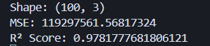
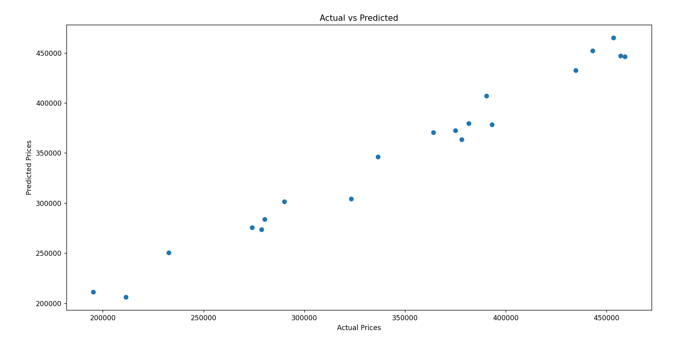

# House Price Prediction Model

A machine learning project that predicts house prices based on house size and number of bedrooms using linear regression.

## 📋 Project Overview

This project implements a simple yet effective house price prediction model using scikit-learn's Linear Regression algorithm. The model analyzes the relationship between house features (size and bedrooms) and their corresponding prices to make accurate predictions.

## 🎯 Features

- **Data Loading & Preprocessing**: Handles CSV data with automatic missing value removal
- **Linear Regression Model**: Uses scikit-learn's LinearRegression for price prediction
- **Model Evaluation**: Provides comprehensive metrics including MSE and R² score
- **Visualization**: Generates scatter plots comparing actual vs predicted prices
- **Train-Test Split**: Implements proper data splitting for model validation

## 📊 Dataset

The project uses a dataset (`random_house_prices`) containing:
- **Size**: House size in square feet
- **Bedrooms**: Number of bedrooms
- **Price**: House price (target variable)

**Dataset Statistics:**
- Total records: 101 houses
- Features: 2 (Size, Bedrooms)
- Target: Price

## 🚀 Getting Started

### Prerequisites

Make sure you have the following Python packages installed:

```bash
pip install pandas scikit-learn matplotlib
```

### Installation

1. Clone or download this repository
2. Ensure the CSV file `random_house_prices` is in the same directory
3. Run the prediction script:

```bash
python HousePredict.py
```

## 📈 Model Performance

The model provides the following evaluation metrics:
- **Mean Squared Error (MSE)**: Measures average squared differences between actual and predicted prices
- **R² Score**: Indicates how well the model explains the variance in house prices
- **Visualization**: Scatter plot showing correlation between actual and predicted values

### Sample Output


### Actual vs Predicted Prices Visualization


## 🔧 Code Structure

The main script (`HousePredict.py`) follows these steps:

1. **Data Loading**: Reads the CSV dataset
2. **Data Preprocessing**: Removes missing values
3. **Feature Engineering**: Separates features (Size, Bedrooms) from target (Price)
4. **Train-Test Split**: Divides data into training (80%) and testing (20%) sets
5. **Model Training**: Fits Linear Regression model on training data
6. **Prediction**: Makes predictions on test set
7. **Evaluation**: Calculates MSE and R² score
8. **Visualization**: Creates actual vs predicted price plot

## 📝 Usage Example

```python
# Load and preprocess data
df = pd.read_csv('random_house_prices.csv')
df = df.dropna()

# Prepare features and target
X = df.drop('Price', axis=1)  # Features: Size, Bedrooms
y = df['Price']               # Target: Price

# Train model
model = LinearRegression()
model.fit(X_train, y_train)

# Make predictions
predictions = model.predict(X_test)
```

## 🎨 Visualization

The project generates a scatter plot that helps visualize model performance:
- **X-axis**: Actual house prices
- **Y-axis**: Predicted house prices
- **Ideal scenario**: Points would form a perfect diagonal line
- **Model quality**: Closer points to the diagonal indicate better predictions

As shown in the visualization above, the scatter plot provides insights into how well the model predictions align with actual house prices.

## 🔍 Model Insights

The linear regression model assumes a linear relationship between:
- House size and price
- Number of bedrooms and price

This makes it interpretable and suitable for understanding how each feature contributes to the final price prediction.

## 🚀 Future Improvements

Potential enhancements for the model:
- Add more features (location, age, amenities)
- Try different algorithms (Random Forest, Gradient Boosting)
- Implement cross-validation
- Add feature scaling/normalization
- Include data visualization for exploratory analysis

## 📄 Files Description

- `HousePredict.py`: Main prediction script
- `random_house_prices.csv`: Dataset with house features and prices
- `README.md`: Project documentation

## 🤝 Contributing

Feel free to fork this project and submit pull requests for any improvements!

## 📧 Contact

For questions or suggestions about this house price prediction model, please feel free to reach out.

---

*This project demonstrates fundamental machine learning concepts including data preprocessing, model training, evaluation, and visualization using Python's scientific computing stack.*


